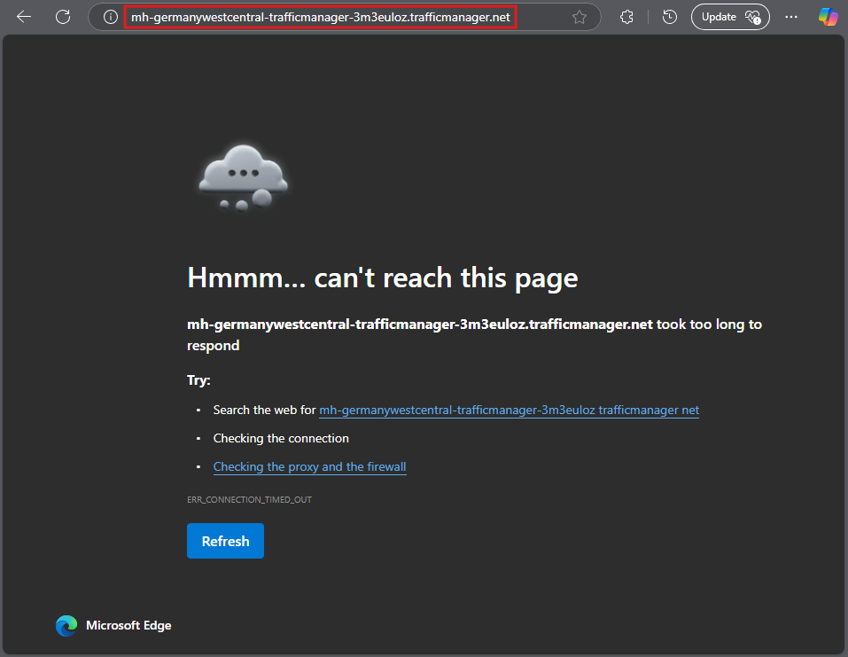
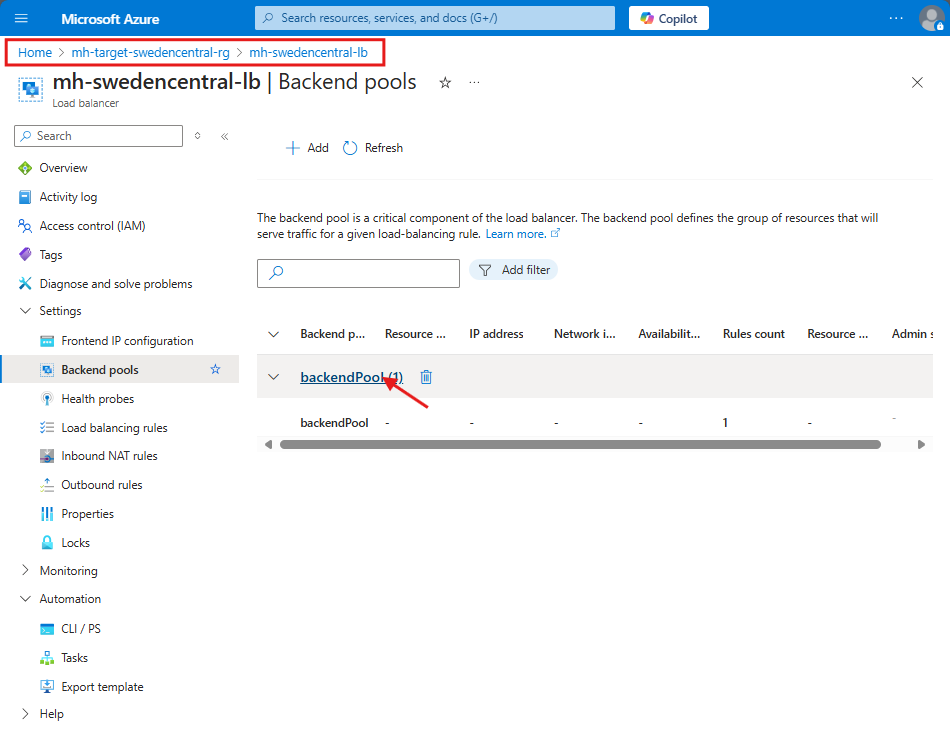
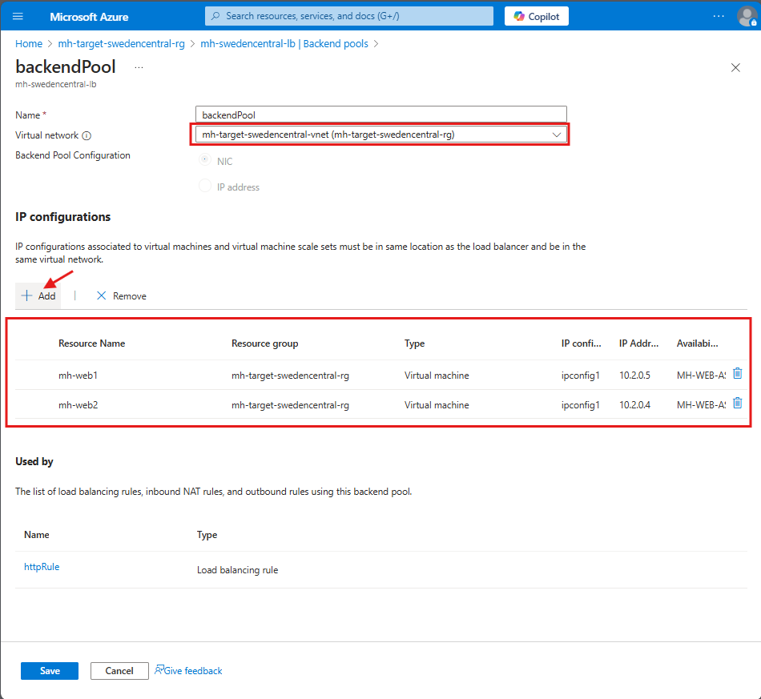
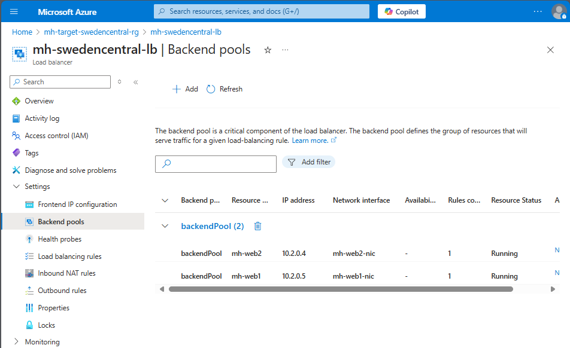
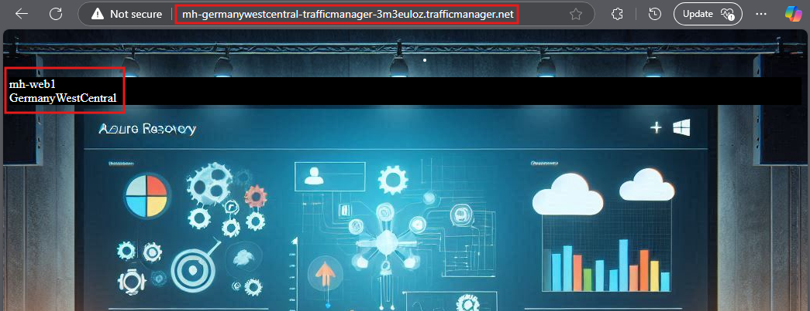
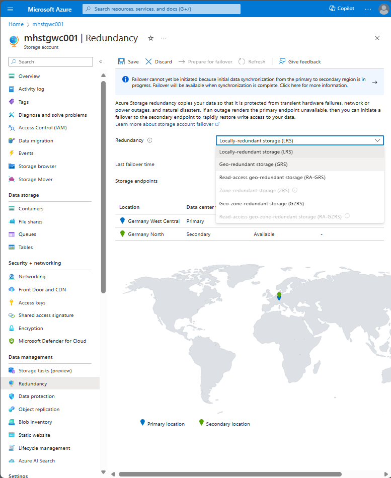
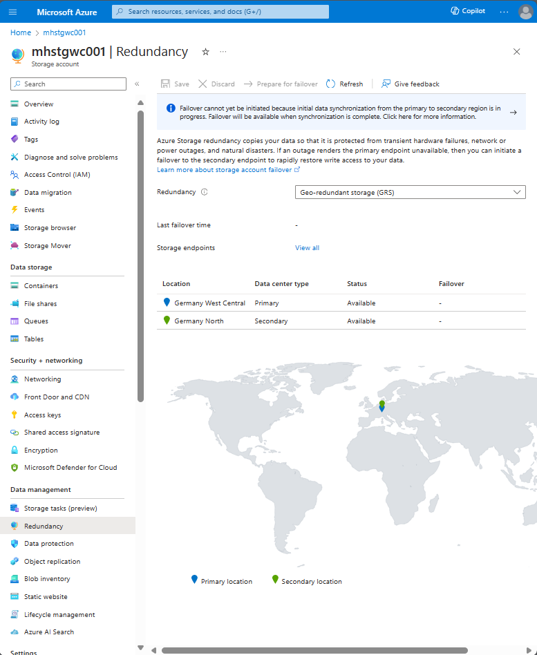
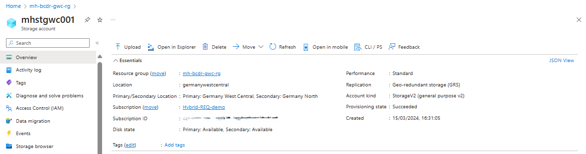
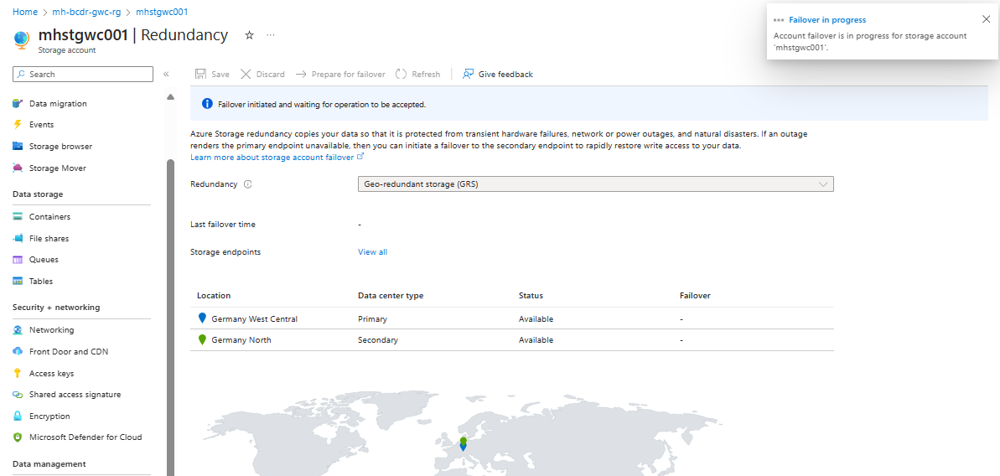

# Walkthrough Challenge 6 - Restore Web Application and verify Azure Storage DR

[Previous Challenge Solution](../challenge-05/solution-05.md) - **[Home](../../Readme.md)** - [Next Challenge Solution](../challenge-07/solution-07.md)

⏰ Duration: 45 minutes

## Solution Overview

This challenge focuses on re-establishing web application connectivity after the DR failover to Sweden Central and verifying that Azure Storage Account disaster recovery is properly configured with GRS. You will add the failed-over VMs to the load balancer and test storage account failover.

## Prerequisites

Ensure Challenge 5 is completed with:
- Web VMs (`mh-web1` and `mh-web2`) failed over and running in Sweden Central
- Load Balancer configured in the environment
- Storage Account with GRS enabled

## Task 1: Re-establish connection to the Web Application

After failing over the VMs to Sweden Central, the web application needs to be reconnected by adding the failed-over VMs to the load balancer's backend pool.

### Add Failed-Over VMs to Load Balancer Backend Pool

1. Navigate to the **Load Balancer** in Sweden Central.

   

2. Go to **Backend pools** and add the failed-over Virtual Machines in the secondary region to the backend pool.

   

   

   

### Test Web Application Connectivity

1. Access the web application through the load balancer and verify it is responding correctly from the Sweden Central region.

   

> **Success!** You have successfully re-established the web application in the secondary region after DR failover.

## Task 2: Disaster Recovery for Azure Storage Account

### Verify GRS Configuration

1. Navigate to the **Storage Account** in Germany West Central (primary region). Select **Redundancy** from the left menu.

   

2. Verify that **Geo-redundant storage (GRS)** is enabled. This enables cross-replication of your storage account with the paired region.

   

3. Identify the secondary region for data replication. You can see the Secondary Region of the Storage Account.

   

> **Note:** With GRS, Azure automatically replicates your data to a secondary region that is hundreds of miles away from the primary region.

### Understanding GRS Replication

**Key Points:**
- Data is replicated asynchronously to the paired region
- The secondary region is read-only by default (use RA-GRS for read access)
- Replication provides protection against regional disasters
- RPO (Recovery Point Objective) is typically less than 15 minutes

### Perform Storage Account Failover Test

> **Important:** Storage account failover should only be performed when the primary region is unavailable. This is a destructive operation that makes the secondary region the new primary.

1. In the Storage Account, go to **Redundancy** or **Geo-replication**
2. Review the failover warnings and implications:
   - Failover typically takes less than an hour
   - Data loss may occur if the last sync was not recent
   - After failover, the account becomes LRS (locally redundant) in the new primary region
3. If performing a test (in a test environment only):
   - Click **Prepare for failover** 
   - Review the impact and confirm
   - Monitor the failover process

   

4. After failover completes, verify:
   - The storage account is now primary in the secondary region
   - Data is accessible from the new primary region
   - Redundancy type has changed to LRS

   

> **Caution:** In a production environment, only perform storage account failover when the primary region is genuinely unavailable.

### Verify Data Accessibility

1. Navigate to the storage account containers
2. List the blobs/files to verify data integrity
3. Attempt to read/download a file to confirm accessibility
4. Check that all containers and data are present

## Success Criteria Validation ✅

Confirm you have completed:
- ✅ Added failed-over VMs to the load balancer backend pool in Sweden Central
- ✅ Successfully accessed the web application through the load balancer
- ✅ Verified the web application is operational in the secondary region
- ✅ Confirmed GRS is enabled on the Storage Account
- ✅ Identified the secondary region used for storage replication
- ✅ Understood the storage account failover process
- ✅ (Optional) Performed a storage account failover test

You have successfully completed Challenge 6! 🚀

## Additional Notes

**Load Balancer Best Practices:**
- Always configure health probes to monitor backend VM health
- Use session persistence if your application requires it
- Monitor load balancer metrics for traffic distribution
- Plan for scaling by adjusting backend pool capacity

**Storage Account GRS Considerations:**
- GRS provides at least 99.99999999999999% (16 nines) durability of objects over a given year
- Use RA-GRS if you need read access to secondary region data
- Monitor last sync time to understand potential data loss window
- Storage account failover is a manual operation - plan and test carefully
- After failover, the account becomes LRS in the new primary region
- You must reconfigure to GRS/RA-GRS if you want geo-redundancy restored

**Disaster Recovery Best Practices:**
- Document the complete recovery procedure
- Test the entire DR process regularly
- Monitor all components after failover
- Have a communication plan for stakeholders
- Plan for failback once the primary region is recovered

